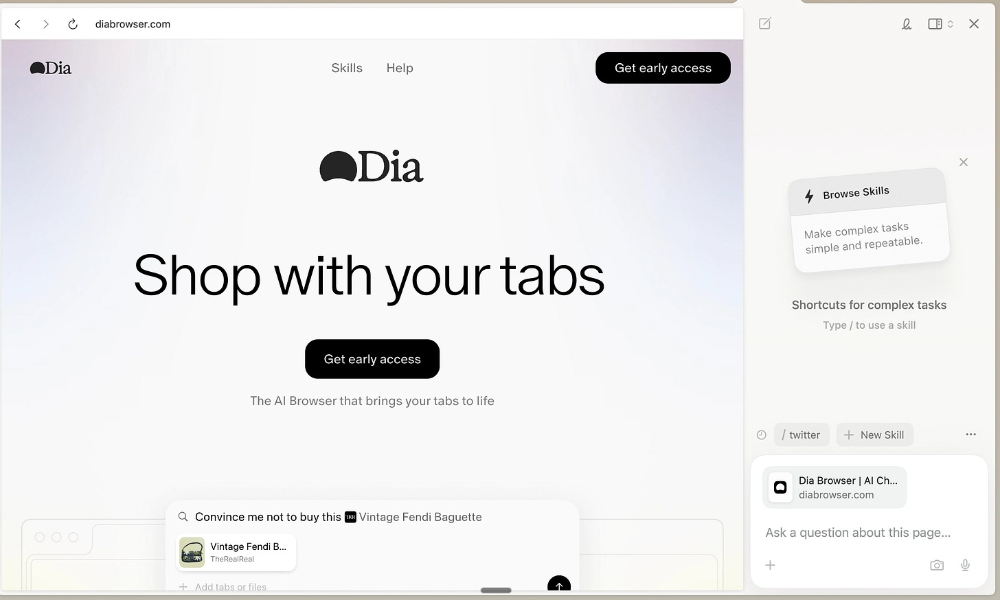
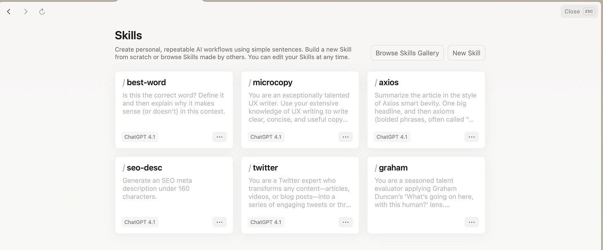
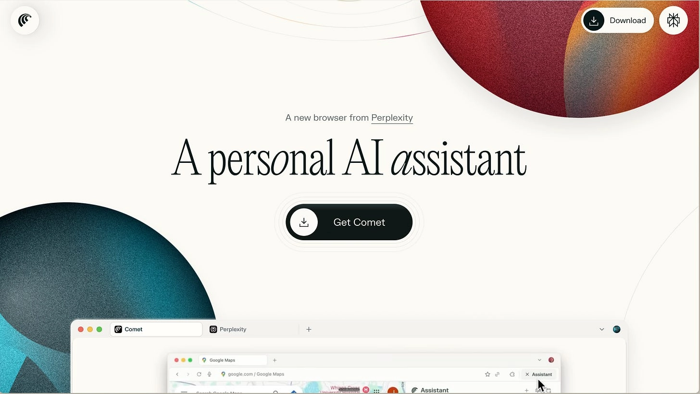
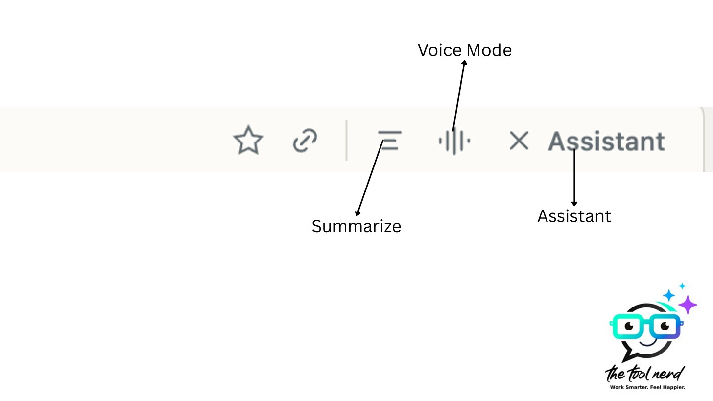

# Comet vs. Dia Browser: Which AI Browser Actually Works Better Right Now?

---

Choosing between **Perplexity Comet** and **Dia Browser** isn't just about picking a new app—it's about deciding how you want AI to fit into your daily browsing. Dia offers polished, context-aware assistance that works reliably today, while Comet swings for ambitious automation that could reshape how you interact with the web. If you need stability and smart features now, Dia wins. If you're curious about where **agentic browsers** might go next, Comet's worth watching—even if it's still finding its footing.

---

So there's this new thing happening in tech, and it's not about which AI can write the best poem or solve the hardest math problem. It's about your browser—yeah, that thing you probably have open right now with 47 tabs you swear you'll get to later.

Perplexity just launched **Comet**, and The Browser Company (the folks behind Arc) rolled out **Dia Browser**. Both are betting that the future of AI isn't in a chatbot window—it's baked right into the tool you use most: your browser.

And honestly? This isn't just a fresh coat of paint. These are early attempts at what people are calling **agentic browsers**—software that doesn't just show you the web, but actually does stuff on the web for you.

## The Quick Version (If You're in a Hurry)

- **Dia Browser** → Smooth, reliable, context-aware. $20/month Pro Plan with custom Skills.
- **Comet** → Big ambitions: scrape sites, build spreadsheets, send emails. $200/month, invite-only.
- **Dia wins on usability**, Comet on raw potential.
- **Wild fact:** Perplexity offered $34.5 billion for Chrome to supercharge Comet's reach.
- **Verdict:** Today, Dia is better. Tomorrow? Comet might be the one to watch.

## Dia Browser: The One That Just Works

Dia feels like someone actually thought about how you use a browser. Hit **Ctrl+E** (or **Cmd+E** on Mac) and a chat window slides in, ready to help with whatever page you're on. The magic is in the context awareness:

**Dia understands what you're doing across tabs and can act on it without you having to explain every little thing.**

You can even create custom "skills"—think of them as little automation helpers that live inside your browser. I made a Twitter skill that pulled up trending topics, analyzed them, and summarized the chatter for me. The whole thing felt smooth, natural, and—this is key—it actually worked.

Dia also leans into personalization. You can teach it your writing style or preferences, and it remembers. Combine that with thoughtful design—the fonts, the fluid interface—and you get a browser that feels both functional and, honestly, kind of delightful.

Right now, Dia is invite-only and Mac-only (sorry, Windows folks). The **Pro Plan** just launched at **$20/month**, giving you "unlimited" AI access and Skills, though there are soft usage caps. It's early days, but the polish is unmistakable.

👉 [See how AI-powered browsers are changing the way we work online](https://pplx.ai/ixkwood69619635)

## Comet: Big Ideas, Rough Edges

Comet, on the other hand, is swinging for the fences. It has a deep agentic architecture that lets it go way beyond simple tab assistance.

**Press Alt+A and you can literally command it to do things on the web—like "find AI jobs in Hyderabad" or "scrape these pages into an Excel sheet." It'll navigate, extract, and present data back to you in structured form.**

**On paper, this is next-level. In practice? It's a bit rough.** The Excel exports are often messy, email assistance doesn't always hit the mark, and the whole experience feels less polished compared to Dia. Even small quirks—like defaulting to ChatGPT as the search engine in every new tab without an easy way to switch—get in the way.

That said, you can sense the potential.

**Comet feels like the raw power play: an architecture that could eventually automate whole workflows inside the browser, but isn't quite ready for prime time.**

There are some cool features worth mentioning, though. First, there's the instant summary icon—tap it, and Comet quickly digests whatever page you're on, serving up the main points without the fluff. Then there's voice mode, which honestly feels like chatting with your browser. You can ask it questions, get answers in real time, or even tell it to go to a specific page—and it'll actually do it. It's like having a super-responsive co-pilot riding shotgun while you browse.

For now, Comet is invite-only or accessible only to **Perplexity Max users** at **$200/month**. That price point screams "experimental playground" more than "mainstream adoption." Still, Perplexity is doubling down—the CEO even called browsers, not chatbots, the "next killer AI app." And in a move that shook headlines, they placed a **$34.5 billion bid for Google Chrome**, arguing antitrust could force a divestiture.

## Where Things Stand Right Now

If Comet is about raw horsepower, Dia is about refinement.

- **Dia Browser** wins on usability, stability, and design. Its contextual intelligence and skill creation make it genuinely useful *today*.
- **Comet** brings the bolder vision, but with reliability gaps and a user experience that still needs tightening.

The battle reminds me of early mobile OS wars—one product offering stability and polish, the other offering disruptive ambition. The difference this time? The battleground is your browser, the tool you probably spend most of your day in.

## Other Players in the Game

While Comet and Dia are the frontrunners, they're not alone. A wave of agentic browsers is emerging, each experimenting with a slightly different angle:

- **Fellou** – positions itself as an automation-first browser with deep workflow orchestration.
- **Opera Neon** – an experimental AI browser from Opera with features like Neon Chat, Do, and Build.
- **Warmwind OS** – marketed as the first AI-native operating system, streaming a cloud-based agentic environment through the browser.
- **Microsoft Edge (Copilot Mode / Olympia UI)** – experimenting with AI-first browsing experiences.
- **Sigma OS** – a productivity-focused browser designed for multitaskers, offering a unique workspace approach to managing tabs and workflows.
- **Genspark Browser** – smaller entrants carving out niches in the agentic browsing space.

The signal is clear: browsers are no longer passive windows to the web—they're becoming active participants.

---

## Conclusion

Right now, **Dia Browser** is the smarter pick if you want something that works reliably and feels good to use. It's polished, context-aware, and genuinely helpful for everyday tasks. **Comet**, on the other hand, is the ambitious bet—rough around the edges, but packed with potential for deeper automation. If you're curious about where AI-powered browsing is headed, 👉 [explore how tools like Perplexity are reshaping the way we interact with the web](https://pplx.ai/ixkwood69619635). The browser wars are back, and this time, they're smarter.
